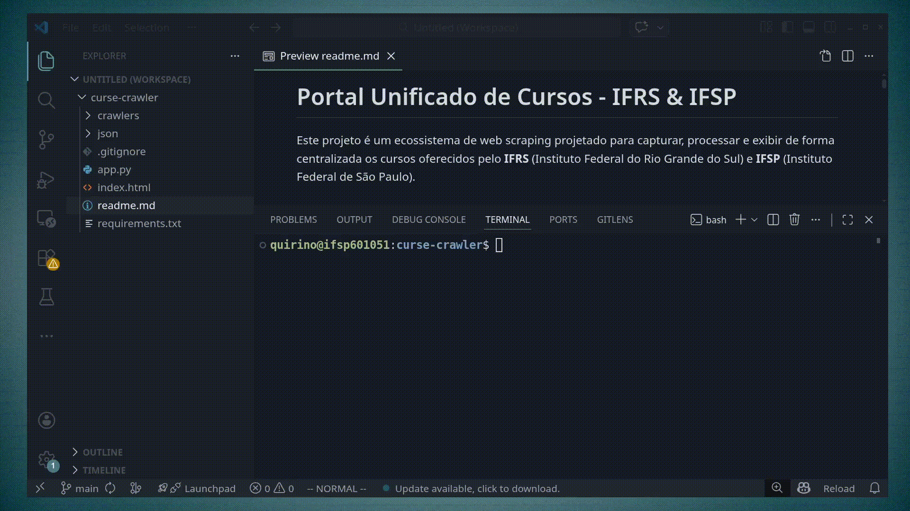

# Portal Unificado de Cursos - IFRS & IFSP

Este projeto é um ecossistema de web scraping projetado para capturar, processar e exibir de forma centralizada os cursos oferecidos pelo **IFRS** (Instituto Federal do Rio Grande do Sul) e **IFSP** (Instituto Federal de São Paulo).

## 1. Arquitetura do Projeto

O projeto utiliza uma abordagem modular dividida em três camadas:

* **Crawlers**: Scripts independentes em Python que extraem dados brutos dos portais institucionais.
* **Data Lake (JSON)**: Pasta que armazena o estado atual dos cursos capturados em formato estruturado.
* **Web Interface**: Um servidor Flask que atua como integrador, normalizando os dados e servindo uma interface interativa com Tailwind CSS.

## 2. Estrutura de Pastas

```text
├── crawlers/           # Scripts .py de extração (Scrapers)
├── json/               # Saída dos scrapers (arquivos .json)
├── app.py              # Servidor Flask e lógica de normalização
├── index.html          # Frontend interativo
├── requirements.txt    # Dependências do sistema
└── .gitignore          # Arquivos ignorados pelo Git

```

## 3. Requisitos

* Python 3.8 ou superior
* Pip (gerenciador de pacotes)

## 4. Instalação e Uso

1. **Clone o repositório:**
```bash
git clone <url-do-repositorio>
cd scrapper_ifrs

```


2. **Crie e ative um ambiente virtual:**
```bash
python -m venv venv
# No Windows:
.\venv\Scripts\activate
# No Linux/Mac:
source venv/bin/activate

```


3. **Instale as dependências:**
```bash
pip install -r requirements.txt

```


4. **Execute o servidor:**
```bash
python app.py

```


5. **Acesse no navegador:**
`http://127.0.0.1:5000`

## 5. Atualização de Dados

Para atualizar a lista de cursos, basta clicar no botão **"Atualizar Scrapers"** diretamente na interface web. O sistema irá:

1. Executar todos os scripts na pasta `/crawlers`.
2. Sobrescrever os arquivos na pasta `/json`.
3. Recarregar automaticamente a listagem na tela.


## Exemplo da implementação e testes



### WARNING!!!

Desenvolvido para fins acadêmicos e de automação institucional.

isso foi "vibecodado" para testes. CUIDADO!
https://gemini.google.com/share/5f6cd1d45f77